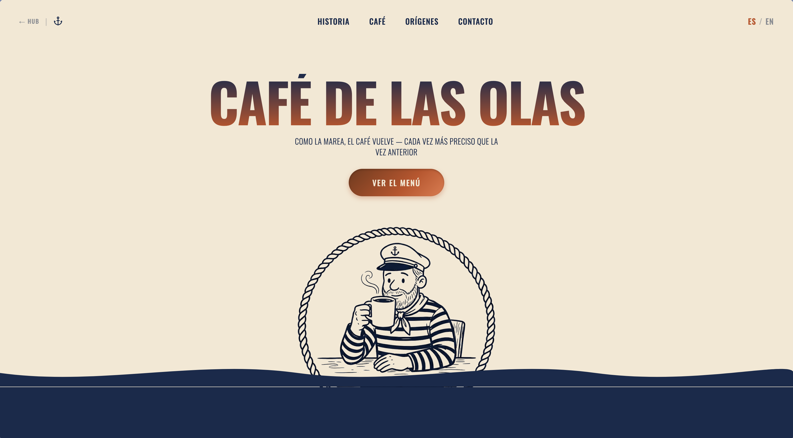
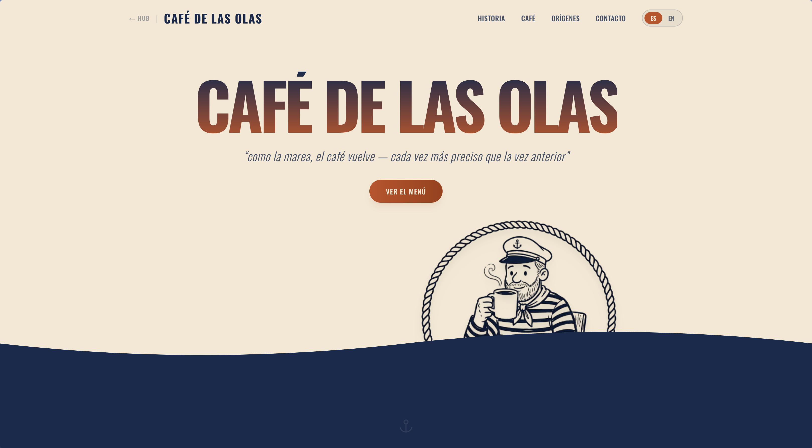
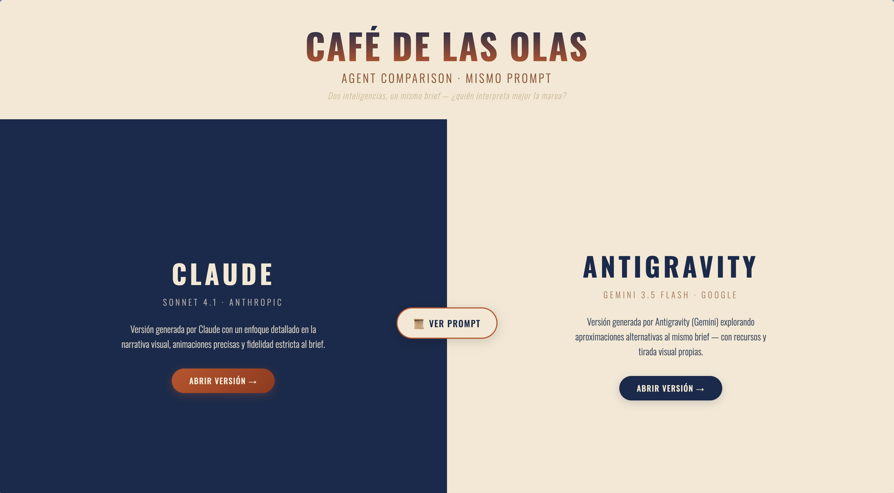

# Café de las Olas — Agent Comparison

Landing page de una cafetería _specialty coffee_ llamada **Café de las Olas**, generada por dos agentes de IA distintos a partir del **mismo prompt**, para analizar diferencias en interpretación, estilo y calidad de resultado.

## Datos del estudiante

| Campo | Valor |
|---|---|
| **Nombre** | Tomás Maldocena |
| **Materia** | PFO2 — Frontend |
| **Agente A** | Claude (Sonnet 4.1) |
| **Agente B** | Antigravity (Gemini 3.5 Flash) |

## Link al deploy

[🌐 Ver proyecto en Vercel](https://cafe-de-las-olas.vercel.app)

> *Nota: el link unificado dirige a `index.html` (hub), desde donde se accede a ambas versiones y al prompt.*

## Estructura del proyecto

```
PFO2 - Frontend/
├── index.html                       ← Hub: split-screen comparativo
├── prompt.html                      ← Prompt completo (copiable)
├── claude/
│   ├── index.html                   ← Entry point de Claude
│   └── src/                         ← Todo el código de Claude
│       ├── main.tsx
│       ├── App.tsx
│       ├── components/
│       ├── sections/
│       ├── context/
│       ├── data/
│       └── assets/
├── antigravity/
│   ├── index.html                   ← Entry point de Antigravity
│   └── src/                         ← Todo el código de Antigravity
│       ├── main.tsx
│       ├── App.tsx
│       ├── components/
│       ├── content.ts
│       └── assets/
├── public/
│   ├── images/                      ← Assets estáticos de Antigravity
│   └── favicon.svg
├── capturas/
├── cafe-de-las-olas-prompt.md       ← Prompt original en Markdown
├── package.json                     ← Root: dependencias unificadas
├── vite.config.ts                   ← Multi-page build
├── vercel.json
└── tailwind.config.js               ← Config compartida
```

## URLs

| Ruta | Contenido |
|---|---|
| `/` | Hub comparativo |
| `/prompt` | Prompt completo (copiable) |
| `/claude/` | Versión Claude (Sonnet 4.1) |
| `/antigravity/` | Versión Antigravity (Gemini 3.5 Flash) |

## El prompt

El mismo prompt exacto fue utilizado para ambos agentes. Se puede consultar completo en:

- [`prompt.html`](./prompt.html) — versión formateada con botón copiar
- [`cafe-de-las-olas-prompt.md`](./cafe-de-las-olas-prompt.md) — archivo original

El prompt es un brief de una landing page para una cafetería specialty coffee con temática náutico-editorial, que incluye: paleta de 5 colores, tipografía Oswald, sistema bilingüe ES/EN, 9 secciones con mecánicas específicas (hero con efecto de marea, marquee scroll-driven, texto animado por caracter, etc.), y componentes reutilizables (FadeIn, AnimatedText, WaveDivider, Primary Button). Ciertas decisiones de layout quedaron abiertas (`[OPEN]`) intencionalmente para evaluar el criterio de cada agente.

## Capturas de pantalla

### Versión Claude (Sonnet 4.1)



### Versión Antigravity (Gemini 3.5 Flash)



### Hub comparativo

<!-- Reemplazar con captura real cuando esté disponible -->


## Cómo correrlo localmente

El proyecto es un monorepo unificado con Vite multi-page. Un solo comando levanta todo:

```bash
npm install
npm run dev
```

En dev mode, Vite sirve todas las rutas:
- `http://localhost:5173/` → Hub
- `http://localhost:5173/prompt.html` → Prompt
- `http://localhost:5173/claude/` → Claude
- `http://localhost:5173/antigravity/` → Antigravity

Para build de producción:

```bash
npm run build     # genera todo en dist/
npm run preview   # previsualiza el build
```

## Deploy en Vercel

Conectar el repositorio a Vercel. Vercel detecta automáticamente `vercel.json` con `"framework": "vite"` y construye con `npm run build`.

## Tecnologías

| Herramienta | Versión Claude | Versión Antigravity |
|---|---|---|
| **Framework** | React 19 + Vite 8 | React 19 + Vite 8 |
| **Lenguaje** | TypeScript | TypeScript |
| **Estilos** | Tailwind CSS | Tailwind CSS |
| **Animaciones** | Framer Motion | Framer Motion |
| **Iconos** | Lucide React | Lucide React |

---

*Preparado con cuidado, calibrado de forma continua.*
